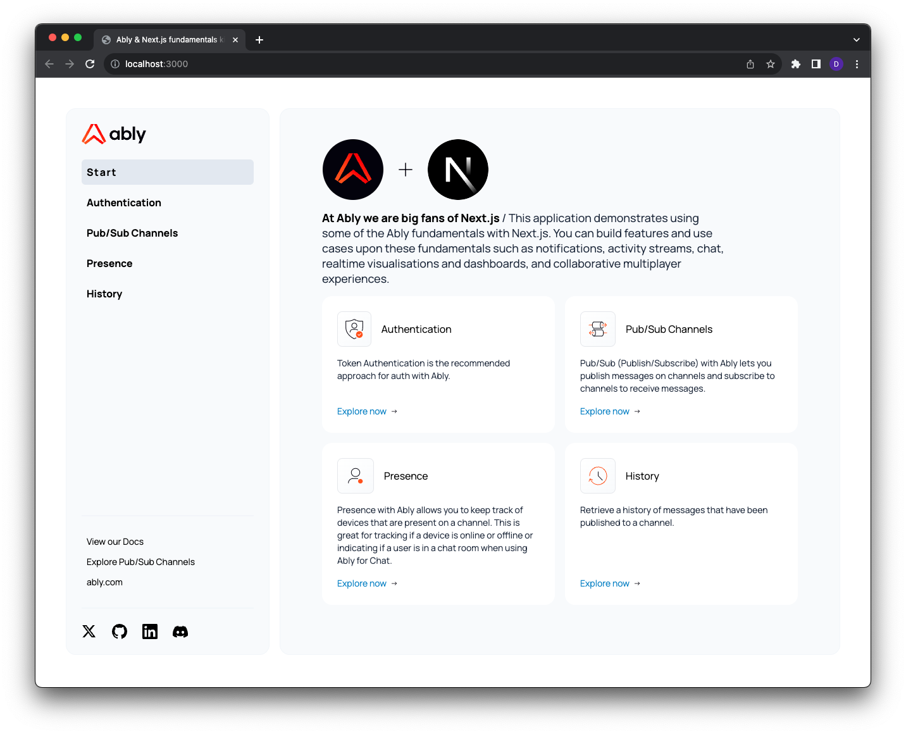

# Ably serverless WebSockets and Next.js fundamentals starter kit



## Description

This [Ably](https://ably.com?utm_source=github&utm_medium=github-repo&utm_campaign=GLB-2211-ably-nextjs-fundamentals-kit&utm_content=ably-nextjs-fundamentals-kit&src=GLB-2211-ably-nextjs-fundamentals-kit-github-repo) and [Next.js](https://nextjs.org) fundamentals starter kit demonstrates using some of the Ably's core functionality with Next.js. You can build features and use cases upon these fundamentals such as notifications, activity streams, chat, realtime visualisations and dashboards, and collaborative multiplayer experiences.

The Ably fundamentals demonstrated within this repo are:

- [Token Authentication](https://ably.com/docs/realtime/authentication?utm_source=github&utm_medium=github-repo&utm_campaign=GLB-2211-ably-nextjs-fundamentals-kit&utm_content=ably-nextjs-fundamentals-kit&src=GLB-2211-ably-nextjs-fundamentals-kit-github-repo#token-authentication) - authenticate and establish a persistent bi-direction connection to the Ably platform.
- [Pub/Sub (Publish/Subscribe)](https://ably.com/docs/realtime/channels?utm_source=github&utm_medium=github-repo&utm_campaign=GLB-2211-ably-nextjs-fundamentals-kit&utm_content=ably-nextjs-fundamentals-kit&src=GLB-2211-ably-nextjs-fundamentals-kit-github-repo) - publish messages on channels and subscribe to channels to receive messages.
- [Presence](https://ably.com/docs/realtime/presence?utm_source=github&utm_medium=github-repo&utm_campaign=GLB-2211-ably-nextjs-fundamentals-kit&utm_content=ably-nextjs-fundamentals-kit&src=GLB-2211-ably-nextjs-fundamentals-kit-github-repo) - keep track of devices that are present on a channel. This is great for tracking if a device is online or offline or indicating if a user is in a chat room when using Ably for Chat.
- [History](https://ably.com/docs/realtime/history?utm_source=github&utm_medium=github-repo&utm_campaign=GLB-2211-ably-nextjs-fundamentals-kit&utm_content=ably-nextjs-fundamentals-kit&src=GLB-2211-ably-nextjs-fundamentals-kit-github-repo) - Retrieve a history of messages that have been published to a channel.

The project uses the following components:

- [Next.js](https://nextjs.org), a flexible React framework that gives you building blocks to create fast web applications.
- [Ably](https://ably.com?utm_source=github&utm_medium=github-repo&utm_campaign=GLB-2211-ably-nextjs-fundamentals-kit&utm_content=ably-nextjs-fundamentals-kit&src=GLB-2211-ably-nextjs-fundamentals-kit-github-repo), for realtime messaging at scale.

## Netlify and Vercel

You can check out the live demo of this app on [Vercel](https://ably-nextjs-fundamentals-kit-one.vercel.app/) or [Netlify](https://ably-nextjs-fundamentals-kit.netlify.app/).

See below for instructions on how to build and deploy this app yourself.

## Building & running locally

### Prerequisites

1. [Sign up](https://ably.com/signup?utm_source=github&utm_medium=github-repo&utm_campaign=GLB-2211-ably-nextjs-fundamentals-kit&utm_content=ably-nextjs-fundamentals-kit&src=GLB-2211-ably-nextjs-fundamentals-kit-github-repo) or [log in](https://ably.com/login?utm_source=github&utm_medium=github-repo&utm_campaign=GLB-2211-ably-nextjs-fundamentals-kit&utm_content=ably-nextjs-fundamentals-kit&src=GLB-2211-ably-nextjs-fundamentals-kit-github-repo) to ably.com, and [create a new app and copy the API key](https://faqs.ably.com/setting-up-and-managing-api-keys?utm_source=github&utm_medium=github-repo&utm_campaign=GLB-2211-ably-nextjs-fundamentals-kit&utm_content=ably-nextjs-fundamentals-kit&src=GLB-2211-ably-nextjs-fundamentals-kit-github-repo).
2. To deploy, create an account on your chosen platform: [Vercel](https://vercel.com) or [Netlify](https://netlify.com).

### Configure the app

Create a `.env.local` file with your Ably API key:

```bash
echo "ABLY_API_KEY={YOUR_ABLY_API_KEY_HERE}">.env
```

### Run the Next.js app

```bash
npm run dev
```

## Deploying

This app can be deployed to either Vercel or Netlify. The codebase is identical for both — only the platform-specific configuration files differ (`vercel.json` for Vercel, `netlify.toml` for Netlify).

### Deploy on Vercel

The easiest way to deploy your Next.js app is to use the [Vercel Platform](https://vercel.com/new?utm_medium=default-template&filter=next.js&utm_source=create-next-app&utm_campaign=create-next-app-readme) from the creators of Next.js.

[](https://vercel.com/new/clone?repository-url=https%3A%2F%2Fgithub.com%2Fably%2Fably-nextjs-fundamentals-kit&env=ABLY_API_KEY)

1. Click the **Deploy with Vercel** button above.
2. Set the `ABLY_API_KEY` environment variable when prompted.
3. Click **Deploy**.

### Deploy on Netlify

You can deploy this app to [Netlify](https://www.netlify.com) using the button below. Netlify uses the `@netlify/plugin-nextjs` plugin (included in `devDependencies`) to handle Next.js server-side features such as API routes.

[](https://app.netlify.com/start/deploy?repository=https%3A%2F%2Fgithub.com%2Fably%2Fably-nextjs-fundamentals-kit)

1. Click the **Deploy to Netlify** button above.
2. Connect your GitHub account and authorize Netlify to clone the repo.
3. Set the `ABLY_API_KEY` environment variable in **Site configuration > Environment variables**.
4. Trigger a deploy.

## Ably + Next.js integration patterns

This project demonstrates several patterns for integrating Ably with the Next.js App Router. Each pattern solves a different challenge that arises from Next.js rendering components on both the server and the client.

### Creating the Ably Realtime client in `useEffect`

The Ably Realtime client (`new Ably.Realtime(...)`) establishes a persistent connection to Ably's servers. For your users to receive realtime messages, that connection needs to live in their browser — if you created it on the server, the server would be the one connected, not the user. In Next.js, component functions run on the server first to produce the initial HTML, so you need to defer Realtime client creation to the browser.

The solution is to create the client inside a `useEffect` hook within a `'use client'` component:

```tsx
'use client'

import { useEffect, useState } from 'react'
import * as Ably from 'ably'

export default function MyComponent() {
  const [client, setClient] = useState<Ably.Realtime | null>(null)

  useEffect(() => {
    const ably = new Ably.Realtime({ authUrl: '/token', authMethod: 'POST' })
    setClient(ably)
    return () => { ably.close() }
  }, [])

  // Server renders this branch — the page still has meaningful HTML
  if (!client) return <LoadingSkeleton />

  // Client hydrates and swaps in the realtime-powered UI
  return <RealtimeUI />
}
```

This gives you the best of both worlds: the server pre-renders a loading shell (headers, layout, static content), and the browser takes over with the live connection once hydration completes.

> **Alternative: `ssr: false` via `next/dynamic`**
>
> You could skip SSR entirely for Ably-powered components using `next/dynamic(() => import('./MyComponent'), { ssr: false })`. This works, but the server sends an empty placeholder for that component — no meaningful HTML, no layout, nothing for search engines to index. The `useEffect` approach is generally preferable because it lets you render useful static content during SSR while deferring only the connection to the browser.

### Sharing a single Realtime client across the app

Without a shared client, each page that uses Ably would create its own `Ably.Realtime` instance. Navigating between pages would close one WebSocket and open another, adding latency and wasting connections.

This project solves that with a provider component ([`app/ably-client-provider.tsx`](app/ably-client-provider.tsx)) that wraps the app in the root layout:

```tsx
// app/ably-client-provider.tsx
'use client'

import { createContext, useContext, useEffect, useState, ReactNode } from 'react'
import * as Ably from 'ably'
import { AblyProvider } from 'ably/react'

const AblyReadyContext = createContext(false)

export function useAblyReady() {
  return useContext(AblyReadyContext)
}

export default function AblyClientProvider({ children }: { children: ReactNode }) {
  const [client, setClient] = useState<Ably.Realtime | null>(null)

  useEffect(() => {
    const ably = new Ably.Realtime({ authUrl: '/token', authMethod: 'POST' })
    setClient(ably)
    return () => { ably.close() }
  }, [])

  if (!client) {
    return <AblyReadyContext.Provider value={false}>{children}</AblyReadyContext.Provider>
  }

  return (
    <AblyProvider client={client}>
      <AblyReadyContext.Provider value={true}>{children}</AblyReadyContext.Provider>
    </AblyProvider>
  )
}
```

```tsx
// app/layout.tsx
import AblyClientProvider from './ably-client-provider'

export default function RootLayout({ children }: { children: React.ReactNode }) {
  return (
    <html lang="en">
      <body>
        <AblyClientProvider>{children}</AblyClientProvider>
      </body>
    </html>
  )
}
```

Key details:

- **Before the client is ready** (server render + initial hydration), children render without `<AblyProvider>`. Pages use `useAblyReady()` to show a loading state during this window.
- **After the client is ready**, children are wrapped in `<AblyProvider>` and all Ably React hooks (`useChannel`, `usePresence`, etc.) work.
- **The connection persists across page navigations** — the root layout never unmounts in the App Router, so the WebSocket stays open.
- **Individual pages still wrap their content in `<ChannelProvider>`** to subscribe to specific channels. The channel attaches when the page mounts and detaches when it unmounts.

### Using Server Components with the Ably REST API

Not every feature needs a live WebSocket connection. The [History page](app/history/page.tsx) fetches historical messages at request time using the Ably REST SDK directly in a Server Component:

```tsx
// app/history/page.tsx  (Server Component — no 'use client')
import * as Ably from 'ably'

const rest = new Ably.Rest(process.env.ABLY_API_KEY!)

export const dynamic = 'force-dynamic'

export default async function HistoryPage() {
  const channel = rest.channels.get('status-updates')
  const page = await channel.history()

  return <HistoryClient initialHistory={page.items} />
}
```

The `Ably.Rest` client is created at module scope — it's a stateless HTTP client with no persistent connection, so a single instance can be safely reused across requests. `force-dynamic` ensures Next.js runs this function on every request rather than caching the result at build time.

This pattern is useful when you need to:

- **Read data once at request time** rather than subscribing to a live stream.
- **Keep API keys on the server** — the REST client authenticates with `ABLY_API_KEY` directly, which is only available in server-side code. No token exchange needed.
- **Deliver content immediately** — the HTML includes the fetched data, so the user sees it without waiting for a client-side connection.

The same approach works for [Route Handlers](https://nextjs.org/docs/app/building-your-application/routing/route-handlers). The [`app/publish/route.ts`](app/publish/route.ts) endpoint uses `Ably.Rest` to publish messages from the server, letting you validate or transform data in a trusted environment before it reaches the channel.

## Contributing

Want to help contributing to this project? Have a look at our [contributing guide](CONTRIBUTING.md)!

## More info

- [Join the Ably Discord server](https://discord.gg/q89gDHZcBK)
- [Follow Ably on Twitter](https://twitter.com/ablyrealtime)
- [Use the Ably SDKs](https://github.com/ably/)
- [Visit the Ably website](https://ably.com?utm_source=github&utm_medium=github-repo&utm_campaign=GLB-2211-ably-nextjs-fundamentals-kit&utm_content=ably-nextjs-fundamentals-kit&src=GLB-2211-ably-nextjs-fundamentals-kit-github-repo)

---
[](https://ably.com?utm_source=github&utm_medium=github-repo&utm_campaign=GLB-2211-ably-nextjs-fundamentals-kit&utm_content=ably-nextjs-fundamentals-kit&src=GLB-2211-ably-nextjs-fundamentals-kit-github-repo)
